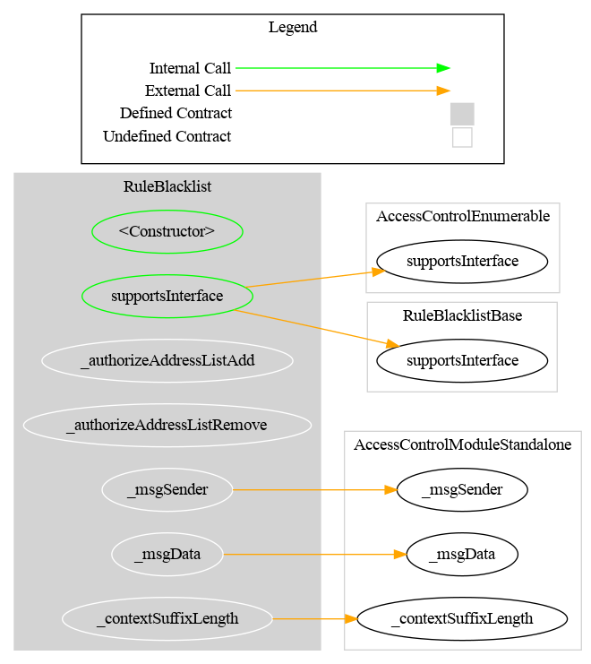
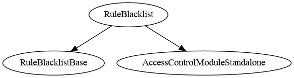

# Rule Blacklist

[TOC]

This rule blocks transfers involving any blacklisted address. Both the sender (`from`) and recipient (`to`) are checked. The spender in a `transferFrom` call is always checked as well.

A significant portion of the address-list management code is shared with the whitelist rule via `RuleAddressSet`.

## Schema

### Graph

### Inheritance

## Restriction codes

| Constant | Code | Meaning |
| --- | --- | --- |
| `CODE_ADDRESS_FROM_IS_BLACKLISTED` | 36 | Sender is blacklisted |
| `CODE_ADDRESS_TO_IS_BLACKLISTED` | 37 | Recipient is blacklisted |
| `CODE_ADDRESS_SPENDER_IS_BLACKLISTED` | 38 | Spender is blacklisted |

## Access Control

The default admin is the address passed as `admin` in the constructor. It is granted `DEFAULT_ADMIN_ROLE`, which implicitly holds all roles.

| Role | Description |
| --- | --- |
| `DEFAULT_ADMIN_ROLE` | Manages all roles; can call all privileged functions |
| `ADDRESS_LIST_ADD_ROLE` | May add addresses to the blacklist (`addAddress`, `addAddresses`) |
| `ADDRESS_LIST_REMOVE_ROLE` | May remove addresses from the blacklist (`removeAddress`, `removeAddresses`) |

## Methods

### `addAddress(address targetAddress)`

Adds a single address to the blacklist. Reverts if the address is already listed.

### `addAddresses(address[] calldata targetAddresses)`

Batch-adds addresses to the blacklist. Silently skips duplicates (no revert).

### `removeAddress(address targetAddress)`

Removes a single address from the blacklist. Reverts if the address is not listed.

### `removeAddresses(address[] calldata targetAddresses)`

Batch-removes addresses from the blacklist. Silently skips addresses not listed (no revert).

### `isAddressListed(address targetAddress) → bool`

Returns `true` if the address is in the blacklist.

### `areAddressesListed(address[] memory targetAddresses) → bool[]`

Returns a boolean array indicating blacklist membership for each address.

## Notes

### Batch vs single operations

Single-item operations (`addAddress`, `removeAddress`) revert on duplicate/missing input. Batch operations (`addAddresses`, `removeAddresses`) skip invalid entries silently.

### Usage scenario

The operator deploys `RuleBlacklist`, grants `ADDRESS_LIST_ADD_ROLE` to a compliance manager, and registers the rule in the `RuleEngine`. The compliance manager calls `addAddresses([badActor])`. Any transfer from, to, or by the blacklisted address is rejected with codes 36, 37, or 38.
