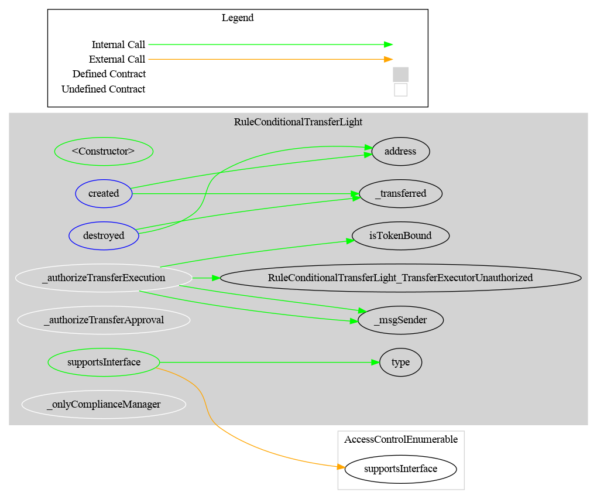
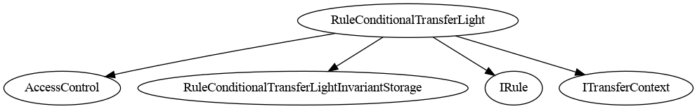

# Rule Conditional Transfer Light

[TOC]

This rule requires that each transfer be explicitly approved by an operator before it can execute. It is an **operation rule**: it modifies state during the transfer call (consuming one approval count), unlike validation rules which are read-only.

Each approval is tracked by a hash of `(from, to, value)`. The same transfer tuple can be approved multiple times (approval count > 1) to allow repeated transfers between the same parties for the same amount.

Mints (`from == address(0)`) and burns (`to == address(0)`) are **exempt**: they always pass without requiring an approval. `created` and `destroyed` follow the same path as `transferred` and return immediately for those cases.

## Schema

### Graph

### Inheritance

## Restriction codes

| Constant | Code | Meaning |
| --- | --- | --- |
| `CODE_TRANSFER_REQUEST_NOT_APPROVED` | 46 | No approval exists for this `(from, to, value)` tuple |

## Access Control

| Role | Description |
| --- | --- |
| `DEFAULT_ADMIN_ROLE` | Manages all roles; implicitly holds all roles below |
| `OPERATOR_ROLE` | May approve or cancel transfer approvals, and call `approveAndTransferIfAllowed` |
| `COMPLIANCE_MANAGER_ROLE` | May bind and unbind token contracts (`bindToken`, `unbindToken`) |

Token execution (`transferred`) is restricted to bound token contracts only.

## Methods

### `approveTransfer(address from, address to, uint256 value)`

Increments the approval count for the `(from, to, value)` hash by 1. Restricted to `OPERATOR_ROLE`. Emits `TransferApproved`.

### `cancelTransferApproval(address from, address to, uint256 value)`

Decrements the approval count for the `(from, to, value)` hash by 1. Reverts if no approval exists. Restricted to `OPERATOR_ROLE`. Emits `TransferApprovalCancelled`.

### `approveAndTransferIfAllowed(address from, address to, uint256 value) → bool`

Approves the transfer and immediately calls `SafeERC20.safeTransferFrom` on the currently bound token, using this rule contract as the spender. Requires `from` to have previously approved this contract for at least `value` tokens. Restricted to `OPERATOR_ROLE`.

### `approvedCount(address from, address to, uint256 value) → uint256`

Returns the current approval count for the `(from, to, value)` tuple.

### `bindToken(address token)` / `unbindToken(address token)`

Binds or unbinds a token contract. Only bound tokens are authorised to call `transferred`. Restricted to `COMPLIANCE_MANAGER_ROLE`.

## Workflow

### Token holder initiates

1. The token holder calls the CMTAT `transfer(to, value)`.
2. The CMTAT calls `detectTransferRestriction` via the RuleEngine — returns code 46 if no approval exists.
3. The operator (off-chain or via contract) calls `approveTransfer(from, to, value)`.
4. The token holder retries the transfer. `detectTransferRestriction` returns 0 (OK).
5. The CMTAT calls `transferred(from, to, value)` which consumes one approval count.

### Operator initiates

1. The operator calls `approveTransfer(from, to, value)` (or `approveAndTransferIfAllowed` for immediate execution).
2. If using `approveAndTransferIfAllowed`, the token holder must have previously called `approve(ruleAddress, value)` on the token.

## Approval counting

Each call to `approveTransfer` increments the counter by 1. Each successful transfer via `transferred` decrements it by 1. This allows the same `(from, to, value)` tuple to be approved multiple times for repeated transfers.

## Notes

### `transferFrom` spender ignored

For `transferred(spender, from, to, value)`, the spender address is ignored. Approval lookup is based solely on `(from, to, value)`.

### Duplicate approvals

Multiple approvals for the same `(from, to, value)` tuple are allowed and stack. This enables scenarios where the same transfer is expected to occur multiple times.

## Usage scenario

The issuer deploys `RuleConditionalTransferLight`, grants `OPERATOR_ROLE` to a compliance officer, and calls `bindToken(cmtat)` with `COMPLIANCE_MANAGER_ROLE`. Investor Alice wants to transfer 1,000 tokens to Bob. The compliance officer reviews the request off-chain and calls `approveTransfer(alice, bob, 1000)`. Alice's transfer then succeeds, and the approval is consumed. A subsequent transfer of the same amount requires a new approval.
