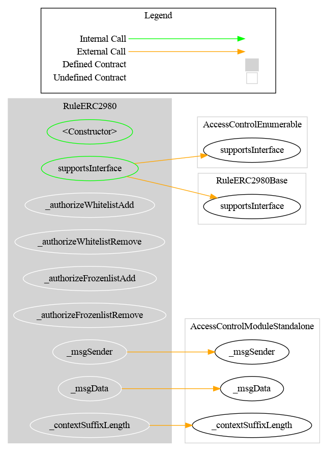
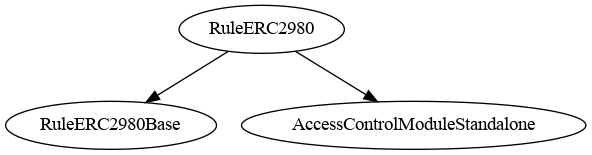

# Rule ERC-2980

[TOC]

This rule implements the [ERC-2980](https://eips.ethereum.org/EIPS/eip-2980) Swiss Compliant Asset Token transfer restriction. It combines two independent address lists managed within a single contract:

- **Whitelist**: only whitelisted addresses may **receive** tokens. Senders do not need to be whitelisted and may freely transfer tokens they already hold.
- **Frozenlist**: frozen addresses are completely blocked — they can neither send nor receive tokens.
- **Priority**: the frozenlist is checked first. If `from`, `to`, or `spender` is frozen, the transfer is rejected regardless of whitelist membership.

## Schema

### Graph

### Inheritance

## Restriction codes

| Constant | Code | Meaning |
| --- | --- | --- |
| `CODE_ADDRESS_FROM_IS_FROZEN` | 60 | Sender is frozen |
| `CODE_ADDRESS_TO_IS_FROZEN` | 61 | Recipient is frozen |
| `CODE_ADDRESS_SPENDER_IS_FROZEN` | 62 | Spender is frozen |
| `CODE_ADDRESS_TO_NOT_WHITELISTED` | 63 | Recipient is not whitelisted |

## Access Control

| Role | Description |
| --- | --- |
| `DEFAULT_ADMIN_ROLE` | Manages all roles; implicitly holds all roles below |
| `WHITELIST_ADD_ROLE` | May add addresses to the whitelist |
| `WHITELIST_REMOVE_ROLE` | May remove addresses from the whitelist |
| `FROZENLIST_ADD_ROLE` | May add addresses to the frozenlist |
| `FROZENLIST_REMOVE_ROLE` | May remove addresses from the frozenlist |

## Constructor burn configuration

- `RuleERC2980(address admin, address forwarderIrrevocable, bool allowBurn)`
- `RuleERC2980Ownable2Step(address owner, address forwarderIrrevocable, bool allowBurn)`

If `allowBurn` is `true`, the constructor whitelists `address(0)` so burn/redemption transfers to `address(0)` are allowed.
If `allowBurn` is `false`, `address(0)` is not whitelisted by default and burn/redemption transfers revert with `CODE_ADDRESS_TO_NOT_WHITELISTED` (`63`).

## Whitelist methods

### `addWhitelistAddress(address targetAddress)`

Adds a single address to the whitelist. Reverts if already listed.

### `addWhitelistAddresses(address[] calldata targetAddresses)`

Batch-adds addresses to the whitelist. Silently skips duplicates.

### `removeWhitelistAddress(address targetAddress)`

Removes a single address from the whitelist. Reverts if not listed.

### `removeWhitelistAddresses(address[] calldata targetAddresses)`

Batch-removes addresses from the whitelist. Silently skips addresses not listed.

### `isWhitelisted(address targetAddress) → bool`

Returns `true` if the address is whitelisted.

### `areWhitelisted(address[] memory targetAddresses) → bool[]`

Returns a boolean array for batch whitelist membership check.

### `whitelistAddressCount() → uint256`

Returns the total number of whitelisted addresses.

### `whitelist(address _operator) → bool`

ERC-2980 interface getter. Equivalent to `isWhitelisted`.

## Frozenlist methods

### `addFrozenlistAddress(address targetAddress)`

Adds a single address to the frozenlist. Reverts if already listed.

### `addFrozenlistAddresses(address[] calldata targetAddresses)`

Batch-adds addresses to the frozenlist. Silently skips duplicates.

### `removeFrozenlistAddress(address targetAddress)`

Removes a single address from the frozenlist. Reverts if not listed.

### `removeFrozenlistAddresses(address[] calldata targetAddresses)`

Batch-removes addresses from the frozenlist. Silently skips addresses not listed.

### `isFrozen(address targetAddress) → bool`

Returns `true` if the address is frozen.

### `areFrozen(address[] memory targetAddresses) → bool[]`

Returns a boolean array for batch frozenlist membership check.

### `frozenlistAddressCount() → uint256`

Returns the total number of frozen addresses.

### `frozenlist(address _operator) → bool`

ERC-2980 interface getter. Equivalent to `isFrozen`.

## Notes

### Sender whitelist exemption

Under ERC-2980, the sender is explicitly exempt from the whitelist check. An address that already holds tokens may always send them, even if it is not whitelisted. However, frozen senders are still blocked.

### Deviation from ERC-2980 example interface

The ERC-2980 example `Whitelistable` and `Freezable` interfaces return `false` on duplicate/missing operations. This implementation follows the codebase convention of reverting for single-item operations, while batch operations silently skip invalid entries.

### `isVerified` semantics

`isVerified(address)` reflects whitelist membership only. A frozen address that is also whitelisted returns `true` for `isVerified`, because freezing is a temporary enforcement action and does not revoke identity verification.

## Usage scenario

The compliance manager deploys `RuleERC2980` and grants separate roles for whitelist and frozenlist management. Investor Alice is added to the whitelist. Bob, a sanctioned actor, is added to the frozenlist. When Bob tries to send tokens, the frozenlist check fires first and rejects with code 60. When an unlisted address tries to receive tokens, the whitelist check rejects with code 63.
