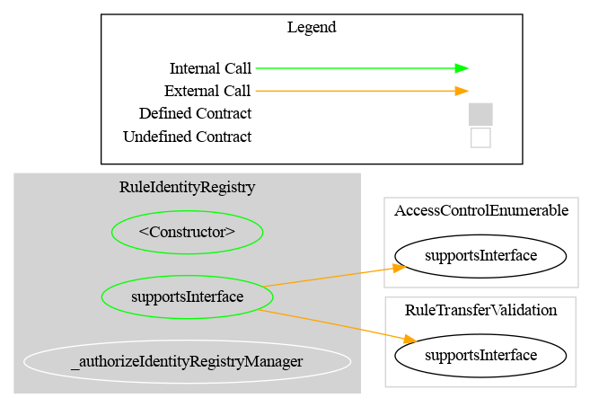
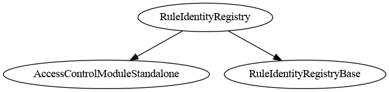

# Rule Identity Registry

[TOC]

This rule checks an [ERC-3643](https://eips.ethereum.org/EIPS/eip-3643) Identity Registry to verify that transfer participants are registered and verified. When an identity registry is configured, the sender, recipient, and spender (in `transferFrom`) are all checked via `isVerified()`.

## Configuration

### Constructor parameters

| Parameter | Description |
| --- | --- |
| `admin` | Address granted `DEFAULT_ADMIN_ROLE` (implicitly holds all roles) |
| `identityRegistry_` | Address of the identity registry contract (`address(0)` to start without a registry) |

### Behaviour when no registry is set

If no identity registry is configured (`address(0)`), all transfers pass this rule. The registry can be set post-deployment with `setIdentityRegistry`.

## Schema

### Graph

### Inheritance

## Restriction codes

| Constant | Code | Meaning |
| --- | --- | --- |
| `CODE_ADDRESS_FROM_NOT_VERIFIED` | 55 | Sender is not verified in the identity registry |
| `CODE_ADDRESS_TO_NOT_VERIFIED` | 56 | Recipient is not verified in the identity registry |
| `CODE_ADDRESS_SPENDER_NOT_VERIFIED` | 57 | Spender is not verified in the identity registry |

## Access Control

| Role | Description |
| --- | --- |
| `DEFAULT_ADMIN_ROLE` | May set or clear the identity registry address |

## Methods

### `setIdentityRegistry(address newRegistry)`

Sets the identity registry contract. Reverts if the address is zero. Restricted to `DEFAULT_ADMIN_ROLE`. Emits `IdentityRegistryUpdated`.

### `clearIdentityRegistry()`

Removes the identity registry (sets it to `address(0)`), disabling verification checks. Restricted to `DEFAULT_ADMIN_ROLE`. Emits `IdentityRegistryUpdated`.

### `identityRegistry() → IIdentityRegistryVerified`

Returns the current identity registry address. Returns `address(0)` if none is set.

## Transfer restriction logic

- If no registry is set → all transfers pass.
- Burns (`to == address(0)`) always pass, even if the sender is not verified.
- For all other transfers:
  - `from` is checked if non-zero (mints where `from == address(0)` skip the sender check).
  - `to` is always checked.
  - `spender` is checked in `transferFrom` if non-zero.

## Usage scenario

The operator deploys `RuleIdentityRegistry` and calls `setIdentityRegistry(registry)`. The registry is maintained by a compliance provider who verifies investor identities. When Alice (unverified) attempts to receive tokens, `isVerified(alice)` returns `false` and the transfer is rejected with code 56. After the registry marks Alice as verified, the transfer succeeds. Calling `clearIdentityRegistry()` disables checks entirely.
