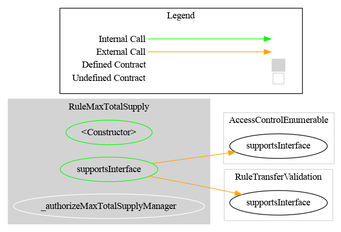
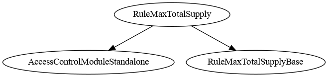

# Rule Max Total Supply

[TOC]

This rule restricts minting so that the token's total supply never exceeds a configured maximum. Only mint operations (`from == address(0)`) are checked. Regular transfers between holders and burns are not affected.

## Configuration

### Constructor parameters

| Parameter | Description |
| --- | --- |
| `admin` | Address granted `DEFAULT_ADMIN_ROLE` (implicitly holds all roles) |
| `tokenContract_` | Address of the token contract (must implement `totalSupply()`); must be non-zero |
| `maxTotalSupply_` | Initial maximum total supply cap |

### Post-deployment configuration

Both the cap and the token contract address can be updated by the admin after deployment.

## Schema

### Graph

### Inheritance

## Restriction codes

| Constant | Code | Meaning |
| --- | --- | --- |
| `CODE_MAX_TOTAL_SUPPLY_EXCEEDED` | 50 | Mint would cause total supply to exceed the maximum |

## Access Control

The default admin is the address passed as `admin` in the constructor. It is granted `DEFAULT_ADMIN_ROLE`, which implicitly holds all roles. All privileged operations are gated on `DEFAULT_ADMIN_ROLE`.

| Role | Description |
| --- | --- |
| `DEFAULT_ADMIN_ROLE` | May update the supply cap and token contract address |

## Methods

### `setMaxTotalSupply(uint256 newMaxTotalSupply)`

Updates the maximum total supply cap. Restricted to `DEFAULT_ADMIN_ROLE`. Emits `MaxTotalSupplyUpdated`.

### `setTokenContract(address newTokenContract)`

Updates the reference to the token contract. Reverts if the address is zero. Restricted to `DEFAULT_ADMIN_ROLE`. Emits `TokenContractUpdated`.

### `maxTotalSupply() → uint256`

Returns the current maximum total supply.

### `tokenContract() → ITotalSupply`

Returns the current token contract address.

## Transfer restriction logic

The rule only acts on mint operations (i.e. `from == address(0)`). It reads `tokenContract.totalSupply()` and rejects the mint if `totalSupply + value > maxTotalSupply`. Transfers and burns always pass.

## Usage scenario

The operator deploys `RuleMaxTotalSupply` with `tokenContract = CMTAT_address` and `maxTotalSupply = 1_000_000`. The rule is registered in the `RuleEngine`. When the issuer mints 100,000 tokens and total supply is already 950,000, the mint is rejected with code 50. Transfers between existing holders continue unaffected.
