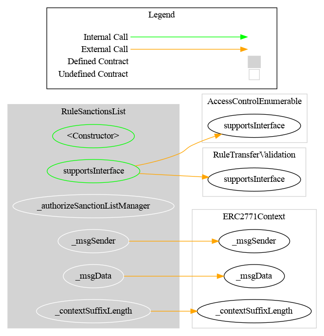
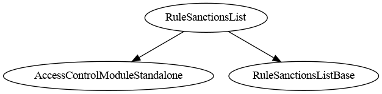

# Rule SanctionsList

[TOC]

This rule uses the [Chainalysis](https://www.chainalysis.com/) on-chain oracle to block transfers involving sanctioned addresses. It checks the US, EU, and UN sanctions lists maintained by the oracle.

## How to use

Deploy the contract pointing to the Chainalysis oracle address. If either the sender (`from`), recipient (`to`), or spender (in `transferFrom`) is flagged by the oracle, the transfer is rejected.

The oracle address and documentation are available here: [Chainalysis oracle for sanctions screening](https://go.chainalysis.com/chainalysis-oracle-docs.html).

The oracle can be updated with `setSanctionListOracle` or disabled with `clearSanctionListOracle`. When no oracle is set (`address(0)`), all transfers pass this rule.

## Schema

### Graph

### Inheritance

## Restriction codes

| Constant | Code | Meaning |
| --- | --- | --- |
| `CODE_ADDRESS_FROM_IS_SANCTIONED` | 30 | Sender is sanctioned |
| `CODE_ADDRESS_TO_IS_SANCTIONED` | 31 | Recipient is sanctioned |
| `CODE_ADDRESS_SPENDER_IS_SANCTIONED` | 32 | Spender is sanctioned |

## Access Control

The default admin is the address passed as `admin` in the constructor. It is granted `DEFAULT_ADMIN_ROLE`, which implicitly holds all roles.

| Role | Description |
| --- | --- |
| `DEFAULT_ADMIN_ROLE` | Manages all roles; can call all privileged functions |
| `SANCTIONLIST_ROLE` | May update or clear the oracle address (`setSanctionListOracle`, `clearSanctionListOracle`) |

## Methods

### `setSanctionListOracle(ISanctionsList sanctionContractOracle_)`

Sets the Chainalysis oracle contract. Reverts if the address is zero. Restricted to `SANCTIONLIST_ROLE`.

### `clearSanctionListOracle()`

Removes the oracle (sets it to `address(0)`), effectively disabling sanctions checks. Restricted to `SANCTIONLIST_ROLE`.

### `sanctionsList() → ISanctionsList`

Returns the current oracle address. Returns `address(0)` if no oracle is set.

## Usage scenario

The operator deploys `RuleSanctionsList` with the Chainalysis oracle address and registers it in the `RuleEngine`. When the CMTAT token triggers a transfer, the rule calls `isSanctioned(from)` and `isSanctioned(to)` on the oracle. If either returns `true`, the transfer is rejected. The operator can later point to an updated oracle by calling `setSanctionListOracle`.
