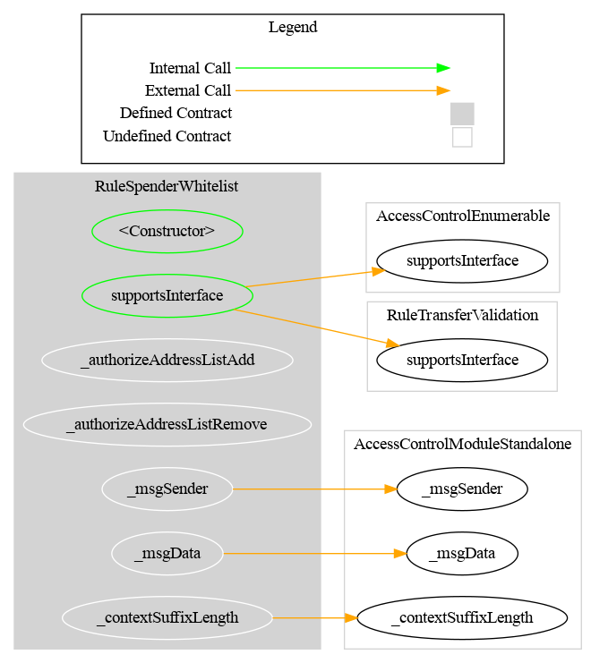
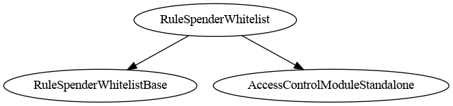

# Rule SpenderWhitelist

[TOC]

This rule restricts only spender-initiated transfers (`transferFrom`): the spender must be listed in an internal whitelist. Regular transfers (`transfer`) are always accepted by this rule.

## Configuration

### Constructor parameters

| Parameter | Description |
| --- | --- |
| `admin` / `owner` | Access-control authority (`AccessControlEnumerable` or `Ownable2Step` variant) |
| `forwarderIrrevocable` | ERC-2771 trusted forwarder address for meta-transactions (use `address(0)` to disable) |

## Schema

### Graph

### Inheritance

## Restriction codes

| Constant | Code | Meaning |
| --- | --- | --- |
| `CODE_ADDRESS_SPENDER_NOT_WHITELISTED` | 66 | `transferFrom` spender is not in the whitelist |

## Access control

### AccessControlEnumerable variant (`RuleSpenderWhitelist`)

| Role | Description |
| --- | --- |
| `DEFAULT_ADMIN_ROLE` | Manages all roles |
| `ADDRESS_LIST_ADD_ROLE` | May add spenders (`addAddress`, `addAddresses`) |
| `ADDRESS_LIST_REMOVE_ROLE` | May remove spenders (`removeAddress`, `removeAddresses`) |

### Ownable2Step variant (`RuleSpenderWhitelistOwnable2Step`)

Owner can manage the spender list and transfer ownership with two-step acceptance.

## Behavior

### Direct transfer path

`detectTransferRestriction(from, to, value)` always returns `TRANSFER_OK`.
`transferred(from, to, value)` is a no-op and never reverts.

### Spender path (`transferFrom`)

`detectTransferRestrictionFrom(spender, from, to, value)` returns:
- `66` if `spender` is not listed
- `0` otherwise

`transferred(spender, from, to, value)` reverts with `RuleSpenderWhitelist_InvalidTransferFrom` when the spender is not listed.

## Notes

- The rule does not validate `from` or `to` addresses.
- The rule also supports ERC-7943 tokenId/context overloads through `RuleNFTAdapter`.
- Batch add/remove follows the project convention: skips duplicates/missing entries without reverting.
