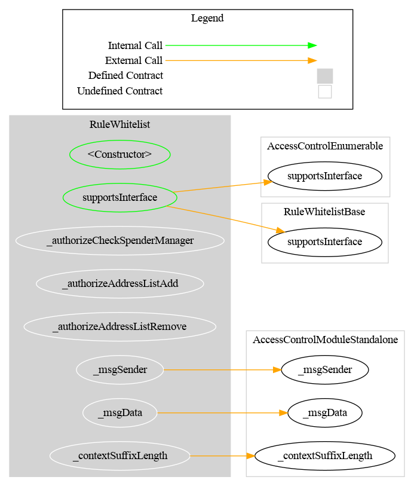
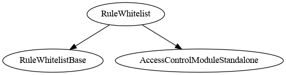

# Rule Whitelist

[TOC]

This rule restricts transfers so that only whitelisted addresses may send and receive tokens. Optionally, spender addresses (used in `transferFrom`) can also be checked.

## Configuration

### Constructor parameters

| Parameter | Description |
| --- | --- |
| `admin` | Address granted `DEFAULT_ADMIN_ROLE` (implicitly holds all roles) |
| `forwarderIrrevocable` | ERC-2771 trusted forwarder address for meta-transactions (use `address(0)` to disable) |
| `checkSpender_` | If `true`, `transferFrom` spender address is also verified against the whitelist |

### `checkSpender` flag

When `checkSpender` is `true`, the spender in a `transferFrom` call must also be whitelisted. This flag can be toggled post-deployment by the admin with `setCheckSpender(bool)`.

## Schema

### Graph

### Inheritance

## Restriction codes

| Constant | Code | Meaning |
| --- | --- | --- |
| `CODE_ADDRESS_FROM_NOT_WHITELISTED` | 21 | Sender is not in the whitelist |
| `CODE_ADDRESS_TO_NOT_WHITELISTED` | 22 | Recipient is not in the whitelist |
| `CODE_ADDRESS_SPENDER_NOT_WHITELISTED` | 23 | Spender is not in the whitelist (only when `checkSpender` is enabled) |

## Access Control

The default admin is the address passed as `admin` in the constructor. It is granted `DEFAULT_ADMIN_ROLE`, which implicitly holds all roles.

| Role | Description |
| --- | --- |
| `DEFAULT_ADMIN_ROLE` | Manages all roles; can call all privileged functions |
| `ADDRESS_LIST_ADD_ROLE` | May add addresses to the whitelist (`addAddress`, `addAddresses`) |
| `ADDRESS_LIST_REMOVE_ROLE` | May remove addresses from the whitelist (`removeAddress`, `removeAddresses`) |

## Methods

### `addAddress(address targetAddress)`

Adds a single address to the whitelist. Reverts if the address is already listed.

### `addAddresses(address[] calldata targetAddresses)`

Batch-adds addresses to the whitelist. Silently skips duplicates (no revert).

### `removeAddress(address targetAddress)`

Removes a single address from the whitelist. Reverts if the address is not listed.

### `removeAddresses(address[] calldata targetAddresses)`

Batch-removes addresses from the whitelist. Silently skips addresses not listed (no revert).

### `isAddressListed(address targetAddress) → bool`

Returns `true` if the address is in the whitelist.

### `areAddressesListed(address[] memory targetAddresses) → bool[]`

Returns a boolean array indicating whitelist membership for each address.

### `setCheckSpender(bool value)`

Enables or disables spender checks for `transferFrom`. Restricted to `DEFAULT_ADMIN_ROLE`.

## Notes

### Zero address

The zero address (`address(0)`) may be added to the whitelist. This is required by CMTAT to allow minting (mints are `transfer(address(0), to, value)`). OpenZeppelin prevents actual ERC-20 transfers to or from the zero address, so this does not create a security issue.

### Batch vs single operations

Single-item operations (`addAddress`, `removeAddress`) revert on duplicate/missing input. Batch operations (`addAddresses`, `removeAddresses`) skip invalid entries silently to allow partial lists without full rollback.

### Usage scenario

The operator deploys `RuleWhitelist`, grants `ADDRESS_LIST_ADD_ROLE` to a compliance manager, and registers the rule in the `RuleEngine`. The compliance manager calls `addAddresses([alice, bob])`. Transfers between whitelisted addresses pass; any transfer from or to an unlisted address is rejected with codes 21 or 22.
