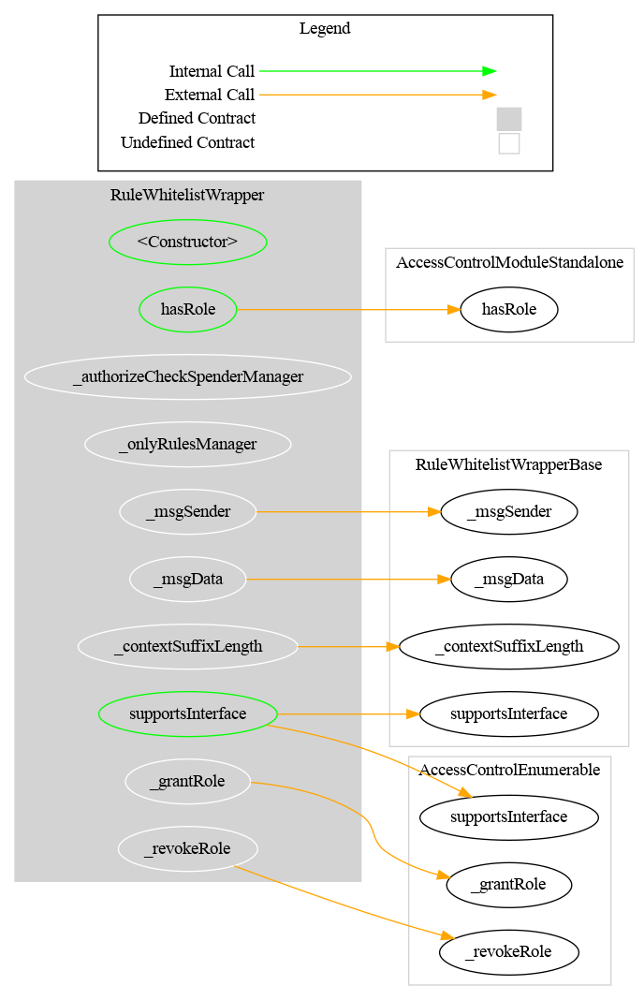
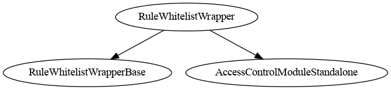

# Rule Whitelist Wrapper

[TOC]

This rule aggregates multiple child whitelist rules using OR logic. An address is considered whitelisted if it appears in **any** of the registered child rules. This enables a multi-operator model where each operator manages their own whitelist independently.

## Architecture

Each child rule must implement `IAddressList`. The wrapper iterates through all registered rules and returns `true` for an address as soon as one rule lists it. Iteration stops early once all required addresses are resolved.

## Schema

### Graph

### Inheritance

## Configuration

### Constructor parameters

| Parameter | Description |
| --- | --- |
| `admin` | Address granted `DEFAULT_ADMIN_ROLE` (implicitly holds all roles) |
| `forwarderIrrevocable` | ERC-2771 trusted forwarder address for meta-transactions (use `address(0)` to disable) |
| `checkSpender_` | If `true`, spender address in `transferFrom` is also validated against child rules |

### `checkSpender` flag

When enabled, the spender in `transferFrom` must be listed in at least one child rule. Toggled post-deployment by the admin with `setCheckSpender(bool)`.

## Restriction codes

The wrapper reuses restriction codes from the whitelist rule:

| Constant | Code | Meaning |
| --- | --- | --- |
| `CODE_ADDRESS_FROM_NOT_WHITELISTED` | 21 | Sender is not in any child whitelist |
| `CODE_ADDRESS_TO_NOT_WHITELISTED` | 22 | Recipient is not in any child whitelist |
| `CODE_ADDRESS_SPENDER_NOT_WHITELISTED` | 23 | Spender is not in any child whitelist (only when `checkSpender` is enabled) |

## Access Control

| Role | Description |
| --- | --- |
| `DEFAULT_ADMIN_ROLE` | Manages all roles; can call all privileged functions |
| `RULES_MANAGEMENT_ROLE` | May add, remove, or set the list of child whitelist rules |

## Methods

### Child rule management

| Function | Role required | Description |
| --- | --- | --- |
| `setRules(address[] rules_)` | `RULES_MANAGEMENT_ROLE` | Replaces the entire list of child rules |
| `addRule(address rule_)` | `RULES_MANAGEMENT_ROLE` | Adds a single child rule |
| `removeRule(address rule_)` | `RULES_MANAGEMENT_ROLE` | Removes a single child rule |
| `clearRules()` | `RULES_MANAGEMENT_ROLE` | Removes all child rules |

### `setCheckSpender(bool value)`

Enables or disables spender checks. Restricted to `DEFAULT_ADMIN_ROLE`.

### `isVerified(address targetAddress) → bool`

Returns `true` if the address is listed in at least one child rule.

### `rule(uint256 index) → address`

Returns the child rule at the given index.

### `rulesCount() → uint256`

Returns the number of registered child rules.

## Notes

### Gas cost

Each transfer check iterates over all registered child rules. The number of child rules should be kept bounded to avoid excessive gas consumption.

### Usage scenario

Three operators (A, B, C) each manage their own `RuleWhitelist`. The `RuleWhitelistWrapper` is configured with all three as child rules. A transfer between any two addresses whitelisted by any one of the operators will pass. The wrapper admin grants `RULES_MANAGEMENT_ROLE` to a coordinator who adds and removes child rules as operators join or leave.
